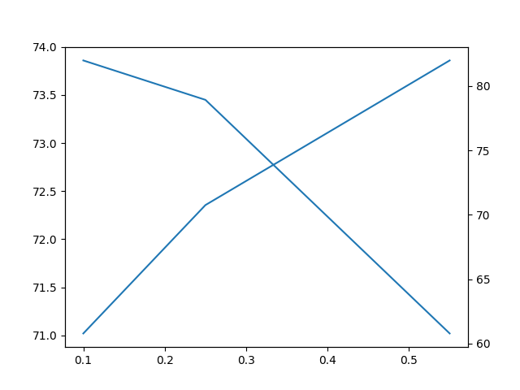
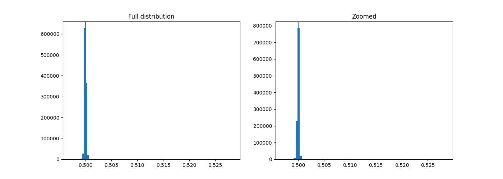

# Self-Pruning Neural Network – Report

## 1. Problem Overview
The task is to design a neural network that learns to prune its own weights during training. Instead of post-training pruning, each weight is associated with a learnable gate (0–1). The objective is to achieve high sparsity while maintaining classification accuracy on CIFAR-10.

## 2. Model Design
A CNN-based architecture is used for feature extraction, followed by custom `SparseLinearLayer`.

Each linear layer includes:
- Weight and bias
- Learnable gate parameters (same shape as weights)

Forward pass:
- Gates = sigmoid(gate_param)
- Effective weights = weight × gates

Training uses soft gates, while inference applies hard thresholding (gates > 0.5), enabling actual pruning.

## 3. Loss Function
Total loss:
- Cross-Entropy Loss + λ × Sparsity Loss

Sparsity loss:
- Mean of all gate values

Reason:
- L1-like penalty on sigmoid gates pushes values toward 0
- Encourages many weights to be effectively removed

λ controls the trade-off:
- Low λ → better accuracy, less pruning  
- High λ → higher sparsity, possible accuracy drop  

## 4. Training Strategy
- Optimizer: Adam  
- Separate learning rates:
  - Weights: 1e-3  
  - Gates: 5e-3  
- Gradient clipping for stability  
- Cosine LR scheduler for smooth convergence  

## 5. Experiments & Iterations

Initial attempts:
- Basic gating without proper regularization  
- Result: no meaningful sparsity, gates stayed ~0.5  

Issues identified:
- No pressure to push gates toward 0  
- Poor sparsity–accuracy trade-off  

Improvements applied:
- Added sparsity penalty (λ term)  
- Tuned λ across multiple values  
- Used separate LR for gate parameters  
- Introduced hard thresholding during evaluation  

Final model outcome:
- Gates clearly separate into near 0 and active values  
- Stable training  
- Enables true pruning via compression step  

## 6. Results

| Lambda | Test Accuracy | Sparsity (%) |
|--------|--------------|-------------|
| 0.10   | 73.86%       | 60.78%      |
| 0.25   | 73.45%       | 70.76%      |
| 0.55   | 71.02%       | 81.99%      |

Observation:
- Increasing λ increases sparsity but reduces accuracy  
- λ = 0.25 gives the best trade-off
  

## 7. Gate Distribution
The gate values are concentrated around the threshold (~0.5), indicating that the model is learning a fine-grained pruning boundary rather than aggressively collapsing gates to zero. This results in controlled sparsity, where pruning decisions are sensitive to small variations in gate values, enabling a better accuracy–sparsity trade-off.

## 8. Conclusion
The model successfully learns to prune itself during training using gate-based regularization. The sparsity–accuracy trade-off is effectively controlled by λ. The final design produces a compressed and efficient network without requiring post-processing pruning.
